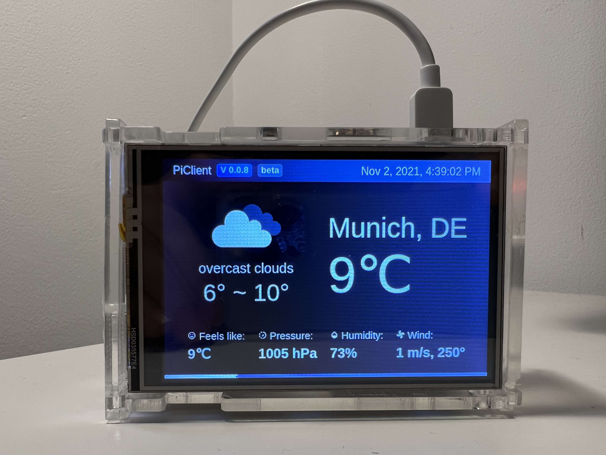
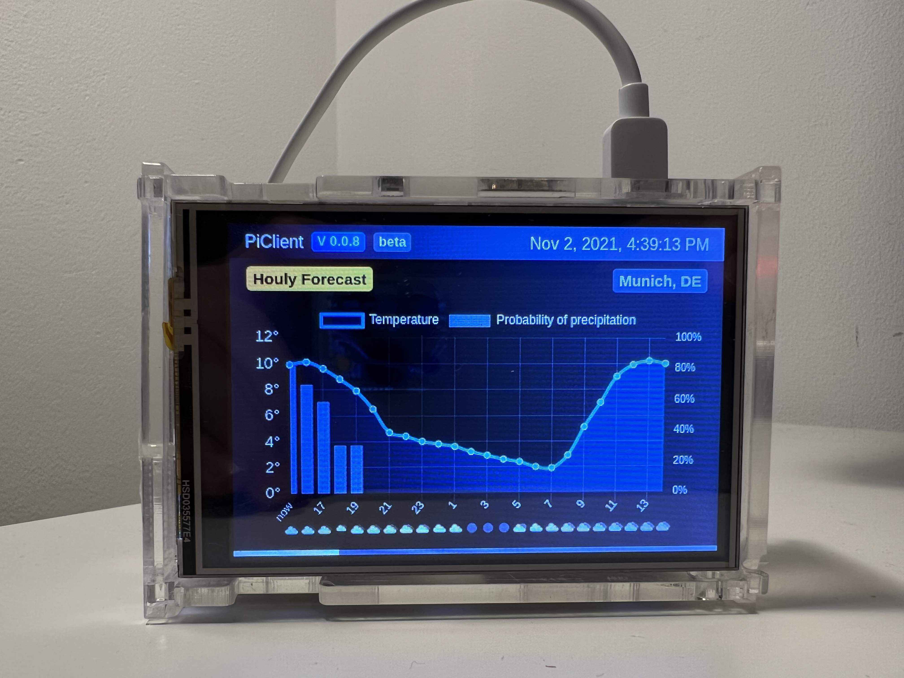
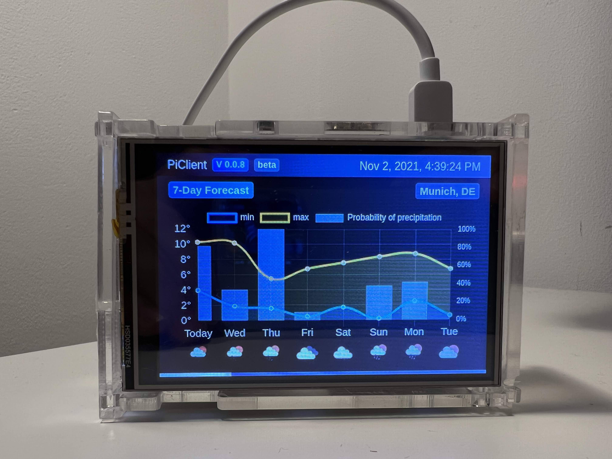
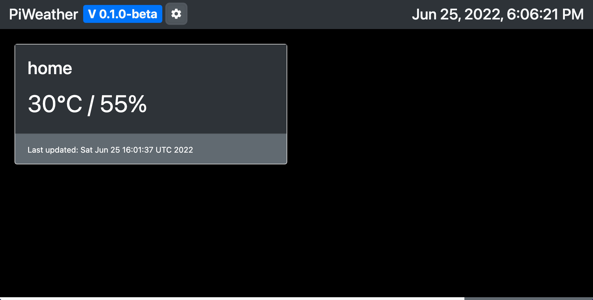

# piWeather


_piWeather_ is a project providing users with weather information.
It consists of _piClient_ as the frontend and _piService_ as the backend.
Its initial purpose is to show weather data on a monitor installed on raspberry pi.

## Introduction

### piClient

_piClient_ is the frontend written in TypeScript and based on Angular.
Although, the pages are dynamically adjusted to fit the device resolution,
it might look better if using a landscape layout.

Demo: [https://pi.zhongpin.wang](https://pi.zhongpin.wang)

### piService

_piService_ serves as the backend of the project using Java Spring Boot.
It provides services including:

- current weather
- 7-day weather forecast
- IP geolocation

Some third-party APIs are used in this project:

- openweathermap.org
- ip-api.com

They both provide free plans for non-commercial use. Thanks a lot for that.

#### Disclaimer:

The project is not built for commercial purposes.
The demo server is used for demonstration purposes only.

Please do not abuse the service of any kind,
though precautions have been made to prevent malicious requests.
The IP address will be recorded to limit the request frequency.
The results of requests will be cached for a pre-defined lifecycle
in order to minimize the number of calls sent to the third-party APIs.

Please pay for the commercial plans of the above-listed services if used for business.

## Usage

### Configure the device using the demo server directly

This project is based on web technology.
Therefore, you can show the pages with **all kinds of devices** running on Linux.
Here, let's take raspberry pi and my own setup as an example.

1. Have a display installed on the raspberry pi and configure it correctly.
   I bought a TFT LCD display on Amazon (https://www.amazon.de/gp/product/B06W55HBTX).
   I don't recommend though to buy this one. There are dozens of other displays, find the one you like the most.

   **Kind reminder:** _If you still want to buy the above model._
   _Be very careful when you attach the screen to the rasp-pi board since the wiring on the side of the touch screen is very fragile and can be easily broken! Don't ask me how I know this. :)_

2. Connect your rasp-pi to wifi and make sure it can reconnect to the internet after each restart.

3. Install the package `unclutter` using `sudo apt install unclutter` to hide the cursor automatically if not moved.

4. Put the following code in `~/.xinitrc`. If the file does not exist, just create one.
   This will launch a chromium browser automatically into kiosk mode after each rebooting.
   The width of the page can be customized in case there is a cut-off on the edge of the screen.
   You can use my demo server or set up your own. Details can be found in the next section.

   ```shell
   #!/bin/sh
   xset -dpms
   xset s off
   xset s noblank

   unclutter &
   chromium-browser https://pi.zhongpin.wang/?w=480 --window-position=0,0 \
       --window-size=480,320 \
       --start-fullscreen --kiosk --incognito --noerrdialogs \
       --disable-translate --no-first-run --fast --fast-start \
       --disable-infobars --disable-features=TranslateUI \
       --disk-cache-dir=/dev/null --password-store=basic
   ```

5. Reboot your device. If everything goes fine, you should see the page.

### Set up your own server using Docker


This section is about using Docker to set up your own backend server.
Skip it if you don't want to have your own server.

Prerequisites: `docker` (and `docker compose`)

**Tip:** In the newest version of docker, docker compose is installed by default as a plugin.

1. Go to the root directory of this project, where you can find `docker-compose.yml`.

2. Put your personal [OpenWeather](https://openweathermap.org/api) API key into the `.env` file.
   Apply for a key on their website if you don't have any.
   This project can work with their free plan. Use it for non-commercial purposes!

3. Get the docker images:

   1. Pull the image directly:

      ```bash
      docker compose pull
      ```

      **Docker Hub:**
      [pi-client](https://hub.docker.com/repository/docker/rssws/pi-client),
      [pi-service](https://hub.docker.com/repository/docker/rssws/pi-service)

   2. Or build the images locally:

      ```bash
      docker compose build
      ```

4. Bring up the containers:
   ```bash
   docker compose up -d
   ```

Then you can access the frontend via `http://localhost:31414`
and the backend via `http://localhost:31414/api/`.

If you want to set up an SSL connection and change the domain name from `localhost` to your own domain,
edit the Nginx configuration file `nginx.conf`.

### Set up your own server using Kubernetes


As an experimental feature, you can use Kubernetes to set up your own services with scaling capability.

You can find relevant files under `./k8s` folder.

You should setup your own Kubernetes cluster first. If you want to use kubernetes on bare metal, these installation scripts might be helpful.

[install k8s with flannel on debian (master)](https://gist.github.com/rssws/e2d82275ef04940b50294dafb3fa6bdd)

[install k8s on debian (worker)](https://gist.github.com/rssws/6a50aaea5b442c1373ee93bb73ccc6b0)

Otherwise, feel free to use GKE, AKS, etc.

The following steps are for the bare metal cluster. If you use cloud providers, you should replace the installation steps for nginx ingress controller and probably `ingress.yml`.

1. Create your own secret from `.env` file.
   - `kubectl create secret generic prod-secrets --from-env-file=.env -o yaml`
2. Install `ingress-nginx` for the bare metal cluster:
   - `kubectl apply -f https://raw.githubusercontent.com/kubernetes/ingress-nginx/controller-v1.3.0/deploy/static/provider/baremetal/deploy.yaml`
   - Check [ingress-nginx#bare-metal-clusters](https://kubernetes.github.io/ingress-nginx/deploy/#bare-metal-clusters) for more example.
3. Apply all yaml files in `k8s` folder.
   - `kubectl apply -f k8s/deployments`
   - `kubectl apply -f k8s/services`
   - `kubectl apply -f k8s/ingress.yml`
4. Get the NodePort of the ingress controller:
   - `kubectl get svc -n ingress-nginx ingress-nginx-controller`
   - Use the ports `3xxxx` for http and https respectively.
   ```
   NAME                       TYPE       CLUSTER-IP      EXTERNAL-IP   PORT(S)                      AGE
   ingress-nginx-controller   NodePort   10.xxx.xxx.123  <none>        80:32232/TCP,443:32745/TCP   63m
   ```

### Compile and build the project locally

#### piClient

`yarn` is used to manage the frontend.
Use `npm install --global yarn` to install `yarn`.

Before you start, you need to run `yarn prepare` to initialize `husky`.

Setup the `.env.dev` and / or `.env.prod` file first before you run the app.
Do not modify `.env` file directly since it will be overwritten!

Use `yarn start` to launch a development server.

Use `yarn build:dev` to build a development version of the app.

Use `yarn build:prod` to build a production version of the app.

Use `yarn lint:fix` to execute linter and prettier.

Please avoid using `ng` command directly since the frontend build depends on `.env`, which will by dynamically generated.

#### piService

Maven is used to manage the backend.

Use `mvn install` to install all dependencies and generate the `jar` file. The file can be found in the `target` folder.

Use `mvn spring-boot:run -Dspring-boot.run.profiles=dev` to launch the server with `dev` profile.
You might need to create this file first and specify the `apiKey`.
Use `application-prod.yml` as a template.

#### piSensor

Starting from `v0.1.0-beta`, we added a new functionality called "local weather".

The idea is to turn your raspberry pi into a temperature and humidity sensor with DHT11.
The script will send the collected data to `piService`, which will be shown in `piClient`.

The monitor page for local weather is hidden in `piClient` by default.
Click on the "setting" to turn it on.

Check more details [here](./piSensor/README.md).

## Gallery

Let's see some pictures taken from the raspberry pi.
The actual looking is better than these photos due to the shooting angles.
Buy a better display rather than TFT LCD to avoid this problem.






## Contribution

Submit an issue if you have any feature request or find a bug.
Create a PR from your fork ([How-to](https://docs.github.com/en/pull-requests/collaborating-with-pull-requests/proposing-changes-to-your-work-with-pull-requests/creating-a-pull-request-from-a-fork)) if you want to contribute directly.

## License

[GPL-3.0 License](./LICENSE)
